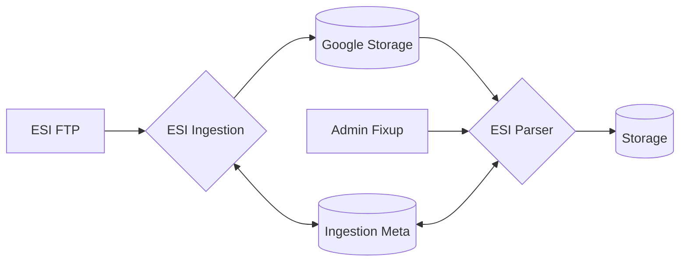
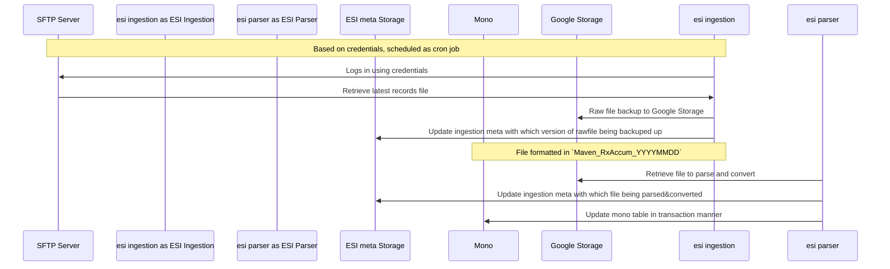

ESI Ingestion Pipeline
----------------------

Background
----------
ESI (Express Scripts Holding) is the RTE (Real time eligibility) provider for Rx(medical prescription).
The contract between ESI and Maven is that ESI will provide non-maven claim
updates, in fixed width file format to a SFTP server in daily basis for Maven to consume.

Goals
-----
Couple of goals I would like to achieve during implementation:
* Exact mirror of raw data into Maven data platform.
* Provide a reliable reproducible ingestion pipeline
* Provide flexibility for adhoc ingestion, re-run
* Provide a generic fixed width file schema generator to simplify file parsing

Non-Goals
---------
* Provide a generic ingestion pipeline for all file ingestion.
* Provide complex state control for jobs contain dependencies

High Level
----------

* System diagram




* Sequence diagram




Detailed Design
--------------

### Ingestion and Parser.
These two jobs are implemented based on RQ job spec. Essentially,
based on the cron tab definition, the ingestion job will be queued
and executed, once the job can succeed without any issue, it will
trigger another async scheduling of parser job with needed information.

### Fixed Width File processor:

Detail can be found at:
[ESI Parser](https://gitlab.com/maven-clinic/maven/maven/-/blob/main/api/direct_payment/pharmacy/tasks/esi_parser/README.md?ref_type=heads)

### Admin fix up
Exposing parser job as API interface for admin/engineers to handle
adhoc issues, i.e. re-ingest certain files, etc.


### Meta data schema design
Meta data is used for representing the status of which file being proceessed 
by most recent job run (including raw ingestion, parser job), the proposed model to capture necessary information
as follow:

Meta data schema design
```sql
    `task_id` int PRIMARY KEY NOT NULL AUTO_INCREMENT,
    -- Store state of the latest job information
    `most_recent_raw` varchar(128),
    `most_recent_parsed` varchar(128),
     -- per task level information
    `started_at` TIMESTAMP DEFAULT CURRENT_TIMESTAMP,
    `updated_at` TIMESTAMP NULL,
    `status` enum('SUCCESS', 'FAILED'),
    `max_tries` int,
    `duration_in_secs` int ,
    `task_type` enum('INCREMENTAL', 'FIXUP') default `INCREMENTAL`,
     -- Job marker
    `job_type` enum('INGESTION', 'PARSER') default 'INGESTION'
     -- Adhoc, for admin fixup ingestion/parser information
    `target_file` varchar(1024),
```

Flow chart:

* Incremental:

Job kick off:
1. Create a new task obj
2. get_the_most_recent_task(contain most_recent_raw) if exist
3. If most_recent_task exist, use `most_recent_raw` as the lower bound
for identifying target new file
4. If most_recent_task does not exist (we could ingest everything, can we do smarter?):
option 1). Ingest every file on the sftp server. update task obj with latest raw file
option 2). Check Google storage. Use the most recent google storage file as lower bound
           if google storage bucket is also empty, fallback to 1)
5. Now we have the [file_names] to download/parse
6. for name in file_names:
      download from sftp server
      decrypted
      upload to Google storage
7. Update: `most_recent_file`, `updated`, `status`, `max_tries`, `duration_in_secs`
8. save to DB
9. Trigger Parser job with: most_recent_raw_file (location in Google storage)
10. Done

* Fixup:
1. Create a new task obj along with `target_file`= command separated string, `task_type` == `fixup`
2. Based on the [file_names] to download/parse
3. for name in file_names:
       repeat incremental 6)
repeat incremental 7)
repeat incremental 8)
repeat incremental 9)
repeat incremental 10)


Trade offs
----------
* Why RQ job over K8s cron for this pipeline?
There are a couple of rationale making this decision:
1) Alerting and observability comes along with RQ job by default
2) Built-in support retry job with metrics around it
3) Job dependency modeled as event in queue. (Ingestion -> Parser)
4) Iteration speed.

* Why do we need additional ESI meta storage?
1) Having an internal meta table tracking job status in different
stage can give us engineers clear understanding of the state of system,
which is extremely useful for debugging issues related to vendor.
2) Resource efficient. Stop early when there's no need to run certain job
when meta indicates the asked job is already ran or raw file is not up in
Google storage.
3) Provide support for logic separation around Parser mode.

* Why reinvent wheels rather than using exiting library for fixed width file?
1) The package we are using [fixedwidth](https://github.com/ShawnMilo/fixedwidth) is fairly
out of date. The most recent PR merged is early 2019.
2) The schema config process is manual
